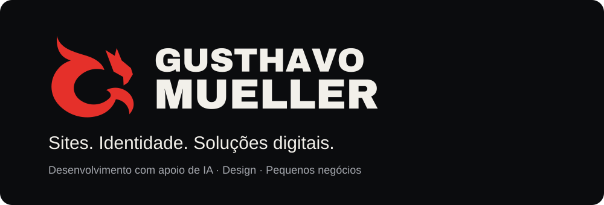

# Gusthavo Mueller

### Sites, identidade visual e soluções digitais com apoio de IA

Crio sites e materiais de marca e desenvolvo projetos de sistemas com apoio de inteligência artificial. Meu trabalho conecta comunicação visual, organização de informação e necessidades reais de pequenos negócios e criadores.

Sou estudante de Arquitetura e Urbanismo, ourives e empreendedor em Jaraguá do Sul, SC. A experiência na Oficina da Jóia Mueller também faz parte do meu olhar para atendimento, produção e processos.

## Como posso contribuir

- **Sites e landing pages:** apresentação de serviços, organização de conteúdo e caminhos claros para contato.
- **Identidade visual e brand kits:** símbolo, paleta, tipografia, templates e organização dos arquivos da marca.
- **Materiais comerciais:** apresentações, media kits e portfólios com informação objetiva e identidade consistente.
- **Desenvolvimento assistido por IA:** transformar ideias em protótipos, interfaces e projetos digitais, usando ChatGPT e ferramentas de IA no processo.
- **Processos e automações:** mapear necessidades e desenhar fluxos para reduzir trabalho repetitivo em pequenos negócios.
- **Vídeo e motion graphics com IA:** apoio à edição e à criação de elementos visuais para conteúdo digital.

## Projetos selecionados

### Oficina da Jóia Mueller

Site de um negócio real de ourivesaria, reunindo serviços, identidade visual e caminhos de contato. Minha atuação no negócio conecta o trabalho digital à rotina de atendimento e produção.

[Visitar o site](https://oficinadajoiamueller.com.br/)

### DJ Diego Feller

Landing page publicada para apresentação artística e contato. Projeto colaborativo de portfólio.

[Ver a landing page](https://dj-diego-feller.mcmueller.chatgpt.site)

### Gusthavo Mueller · Brand Kit

Projeto próprio de identidade visual: símbolo, paleta, tipografia, templates editáveis e organização de ativos para produção com apoio de IA.

### ASCENDE

Projeto próprio de produto digital em desenvolvimento. Espaço de aplicação e aprendizado em organização de funcionalidades, experiência de uso e desenvolvimento assistido por IA.

[Conhecer a ASCENDE](https://ascende.site)

## Meu jeito de trabalhar

Parto do objetivo, organizo o conteúdo, exploro a solução visual e construo com apoio de IA. Uso o termo *vibe coding* para parte desse processo, com atenção à revisão do que será publicado e à clareza sobre o estágio de cada projeto.

Meus primeiros exercícios de HTML e CSS estão preservados como registros de aprendizado:

- [Apresentação pessoal em HTML e CSS](https://github.com/gusthavomueller/trabalhofacul-01)
- [Formulário HTML](https://github.com/gusthavomueller/trabalhofacul-02)

Os projetos selecionados acima também incluem trabalhos publicados fora do GitHub; os links permitem conhecer o resultado sem depender da abertura do código-fonte.

## Em outras redes

[Instagram · @gusthavomueller](https://www.instagram.com/gusthavomueller/) · [LinkedIn](https://www.linkedin.com/in/gusthavomueller/)

---

**English:** I create websites, visual identity systems and digital materials with AI-assisted workflows. Based in Brazil, I bring together design, content and hands-on small-business experience. Fluent in English.
